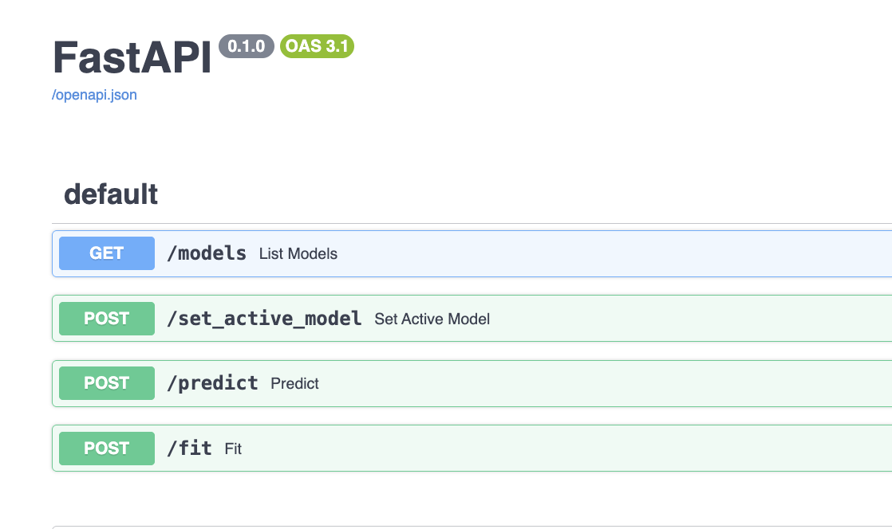
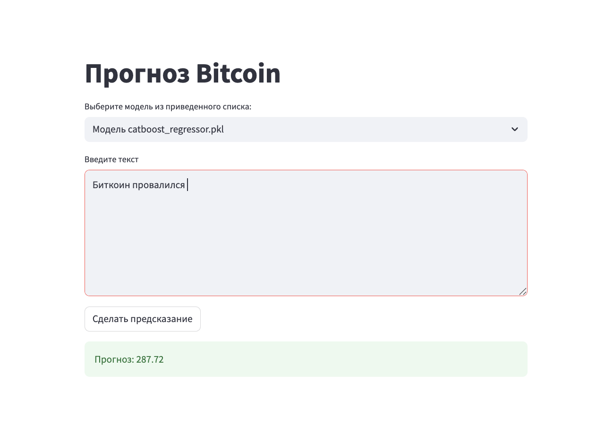
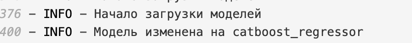

# Проект: Предсказание Цены Биткоина 

## Обзор Проекта

Проект представляет собой комплексное решение для предсказания цены биткоина. Целью проекта является создание масштабируемой, легко развертываемой системы, способной обрабатывать данные, предоставлять предсказания через API и визуализировать результаты через веб-интерфейс.

## Используемые Технологии

Проект построен на следующем стеке технологий:

*   **Язык программирования**: Python 3.11+
*   **Управление зависимостями**: `pip` с `requirements.txt`
*   **Линтинг и форматирование кода**: `ruff`, `flake8`, `black` 
*   **Веб-фреймворк для API**: FastAPI 
*   **Веб-фреймворк для UI**: Streamlit
*   **Контейнеризация**: Docker 
*   **Машинное обучение**: CatBoost, BERTA 
*   **Обработка данных**: Pandas, NumPy
*   **Логирование**: Встроенный модуль `logging` 

## Структура Проекта

📌 Основные ветки:
3_stage – разведочный анализ данных (EDA) и первичная обработка. Здесь собраны графики, статистики и предварительные гипотезы.

main – содержит обучающий ноутбук catboost_notebook.ipynb, объединяющий текстовые эмбеддинги и числовые признаки для построения прогностической модели.

stage_5 – реализация сервисной части: FastAPI для REST-интерфейса и Streamlit для визуализации и взаимодействия с моделью. Логика разнесена по файлам main.py, app_streamlit.py, service.py и другим модулям в директории app/

## Установка и Запуск

1.  **Клонируйте репозиторий**: Если вы еще не клонировали репозиторий, выполните следующую команду:
    ```bash
    git clone https://github.com/allexeyj/btc-predict-ml-project.git
    cd btc-predict-ml-project
    ```
2.  **Запустите сервисы с помощью Docker Compose**: 
    ```bash
    docker-compose up --build
    ```
  

### Доступ к Приложениям

После успешного запуска Docker Compose:

*   **FastAPI Backend**: Доступен по адресу `http://localhost:8000`
*   **Streamlit Frontend**: Доступен по адресу `http://localhost:8501`


### Основные Endpoints

*   **`GET /health`**: Проверка работоспособности сервиса. Возвращает статус `{"status": "ok"}`.
*   **`GET /models`**: Возвращает список всех доступных моделей, загруженных на сервере. Каждая модель представлена `model_id` и `description`
*   **`POST /set_active_model`**: Устанавливает активную модель для предсказаний. Принимает `model_id`.
*   **`POST /predict`**: Выполняет предсказание с использованием активной модели. Принимает текстовые данные (например, заголовки новостей) в поле `text`.
*   **`POST /fit`**: Запускает процесс обучения новой модели в фоновом режиме. 




## Streamlit Frontend

Streamlit приложение предоставляет интуитивно понятный веб-интерфейс для взаимодействия с бэкендом FastAPI и визуализации данных.




### Основные Функции

*   **Создание и обучение моделей**: Пользовательский интерфейс для выбора гиперпараметров и запуска обучения новых моделей через API.
*   **Просмотр информации о моделях**: Отображение списка доступных моделей, их описаний 
*   **Инференс**: Поле для ввода текстовых данных и получения предсказаний от активной модели.

## Логирование

Оба сервиса (FastAPI и Streamlit) настроены на централизованное логирование. Все логи сохраняются в директории `logs/` в корне проекта. 

*   **Формат логов**: `%(asctime)s - %(name)s - %(levelname)s - %(message)s`


